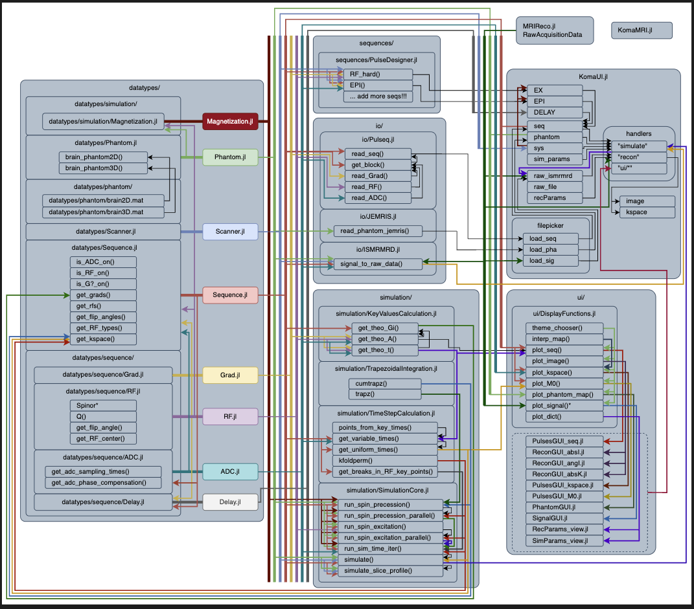
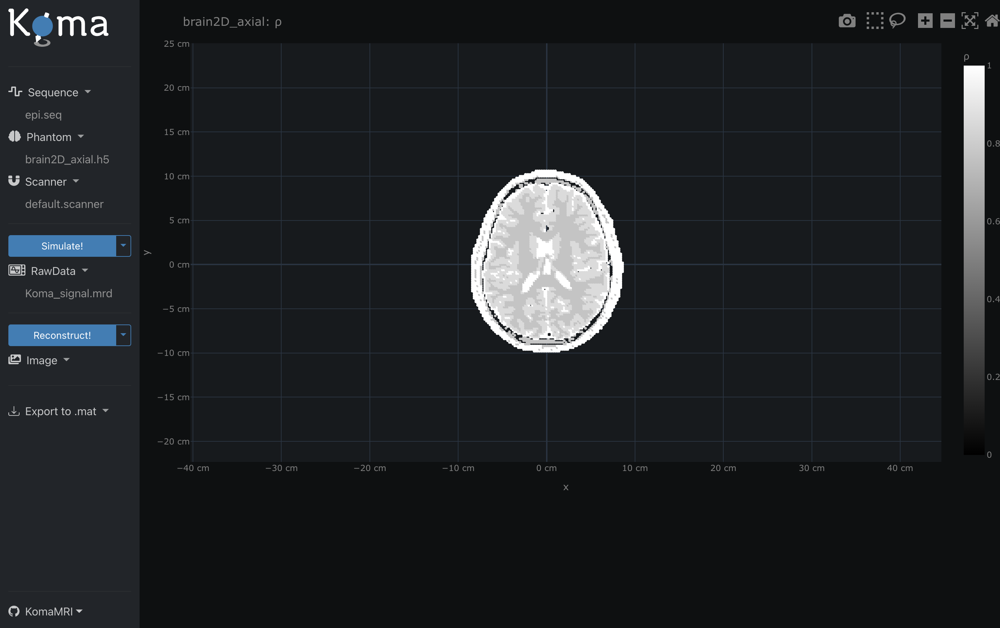
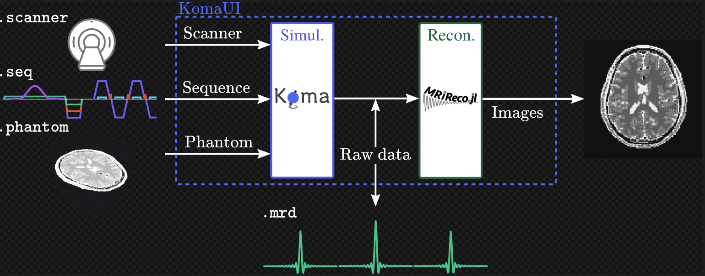

# MRISIMUL_CPU

MRI 시뮬레이션 구조 분석 및 CPU 병렬화 실험 보고  
(2025년 여름 인턴십 @ 메리핸드)

---

##  프로젝트 개요

이 프로젝트는 [KomaMRI](https://github.com/KomaMRI/KomaMRI) 오픈소스를 기반으로 **MRI 물리 시뮬레이션의 구조를 분석**하고, **CPU 병렬 연산의 성능 실험**을 수행한 결과를 정리한 리포지토리입니다.  
추가적으로, **전완근 해부학 모델을 활용한 사용자 정의 시뮬레이션 구조 설계** 가능성까지 탐색했습니다.

---

##  프로젝트 구조(약식)
📁 **KomaMRI/**  
├── 📂 `src/` — 시뮬레이션 관련 소스코드  
├── 📂 `test/` — 테스트 코드  
├── 📂 `images/` — 보고서 및 시각화 자료  
├── 📄 `Project.toml` — Julia 환경 설정 파일  
├── 📄 `README.md` — 프로젝트 소개 (이 파일)  
└── …  

---

##  1주차: 구조 분석

- KomaMRI의 `simulate` → `run_sim_time_iter!` → `run_spin_excitation!` 흐름 분석
- Phantom/Sequence/Spin 흐름 정리 및 Bloch 계산 방식 이해
- 단일 spin 시뮬레이션을 통해 `Bloch()` 방식 확인

  

---

##  2주차: CPU 병렬화 실험

- `Threads.@threads` 기반의 다중 spin 병렬화 수행
- 단일 쓰레드 vs 다중 쓰레드 비교
- Metal.jl 기반 GPU 연산도 비교 실험

  

---

##  확장 아이디어: 해부학 기반 MRI 시뮬레이션

- 전완근 해부학 모델을 기반으로 voxel label 작업 진행 예정
- 3D Slicer → `.nrrd` → Python → `.phantom` 변환 파이프라인 설계 중

  

---

##  사용 기술

- Julia 1.11.5
- KomaMRI (v0.9.1)
- ThreadsX.jl, Metal.jl, HDF5.jl
- 3D Slicer (voxel labeling 도구)

---

##  향후 계획

- Python 및 Unity와의 통합 경로 탐색
- MRI 시뮬레이션 결과 정량 평가 (SSIM, PSNR)
- 근육 사용량 시각화 시스템 설계

---

## 📝 참고

- [KomaMRI 공식 GitHub](https://github.com/KomaMRI/KomaMRI)
- [MRiLab](https://sourceforge.net/projects/mrilab/)
- [3D Slicer](https://www.slicer.org/)